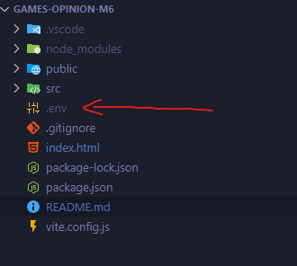

# Proyecto Vue Games Opinions

---

Este proyecto esta realiazdo en Vue + Vite.

Vite es una herramienta de compilación que permite que sexperiencia de desarrollo más rápida y ágil para proyectos web modernos. [Ver más sobre Vite](https://es.vite.dev/guide/#descripcion-general)

### Como Ejecutar el Proyecto :

---

1. **Instalar los paquetes necesarios**

   Para Instalar los paquetes y dependencias necesarios del proyecto debemos ejecutar el siguiente comando:

   ```bash
   npm i
   ```

2. **Agregar el archivo .env**

   Debemos agregar el archivo .env el cual tiene nuestra key de la api de Rawg.io, este archivo debe estar en la raíz de nuestro proyecto, como se muestra en la image:

   

3. **Iniciar el Servidor**

   Una vez ya tenemos completado los pasos 1 y 2, podremos ejecutar nuestro proyecto sin problemas, para esto ejecutamos el siguiente comando:

   ```bash
   npm run dev
   ```

Con esos pasos ya estaremos listo para ejecutar y probar la aplicación, en nuestro ambiente local http://localhost8080
